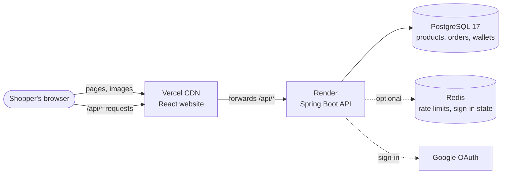
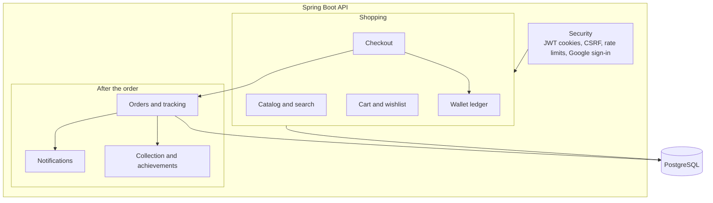
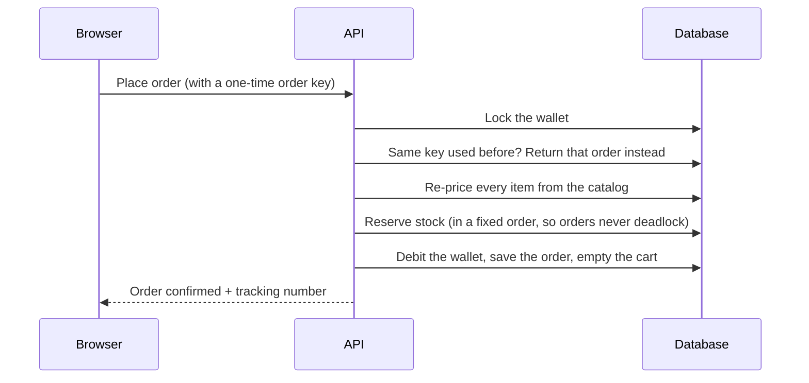

<div align="center">


# TrustKart

**Shop everything. Spend nothing.**

A full-stack technology store that works like the real thing, paid for with a virtual wallet.

[**Open the live store**](https://trustkart-xi.vercel.app) &nbsp;·&nbsp; [Architecture](#architecture) &nbsp;·&nbsp; [Run it locally](#run-it-locally) &nbsp;·&nbsp; [Deployment guide](docs/DEPLOYMENT.md)


</div>

> **First visit may take about a minute.** The server runs on a free plan that sleeps when idle and wakes on the
> first request.

## Contents

- [What it is](#what-it-is)
- [Features](#features)
- [Architecture](#architecture)
- [Tech stack](#tech-stack)
- [Run it locally](#run-it-locally)
- [Testing](#testing)
- [Project layout](#project-layout)
- [Documentation](#documentation)

## What it is

TrustKart is an online electronics store with **1,260+ real products** from **128 brands** across **18
departments**, from iPhones and gaming laptops to GPUs and rack servers. Everything works like a real store:
search, product options, cart, checkout, order tracking and notifications.

The difference: every visitor gets a **TrustKart Wallet with $100,000 of virtual money**. Nothing is charged and
nothing ships, so anyone can try the full shopping experience safely.

## Features

| | |
|---|---|
| 🛍️ **Catalog** | 1,260+ products with official manufacturer photos, full spec sheets and filters by brand, price and specs |
| 🔎 **Search** | Understands phrases like "gaming laptop under $2000" (budget, category and keywords) |
| 🎨 **Product options** | Pick storage, colour or configuration; the price and photo update instantly |
| 🛒 **Cart and checkout** | Four-step checkout (cart, delivery, payment, review) with a saved address book |
| 🚚 **Order tracking** | A seven-day delivery timeline with a tracking number; cancel before it ships, return within 30 days |
| 🔔 **Notifications** | A bell that alerts you when an order ships, goes out for delivery and arrives |
| 🏆 **Achievements** | 76 goals from *First purchase* to *Centibillionaire* ($100 billion spent), bronze to legendary |
| 🥇 **Rankings** | Monthly Top 50 and all-time Top 100 by virtual spend. You appear anonymously unless you pick a public name |
| 🔐 **Accounts** | Email sign-up (Google sign-in is built in and turns on once configured); shop as a guest and your cart follows you when you sign in |
| 🌗 **Design** | Light and dark themes, works on phones, keyboard and screen-reader friendly |

## Architecture

### How the pieces connect

The website is static files on **Vercel**. Every request to `/api/...` is forwarded to the **Spring Boot** server on
**Render**, so the browser only ever talks to one address and login cookies stay private to it.



### Inside the server

The API is one Spring Boot application split into feature modules. Each module owns its own tables.



### What happens when you place an order

Checkout is one database transaction. The server re-prices everything itself, so a browser can never change a
price, and a double click can never create two orders.



Order tracking is calculated from the order time, not stored, so it can never fall out of sync:

`Placed` → `Processing` → `Packed` → `Shipped` → `In transit` → `Local facility` → `Out for delivery` → `Delivered` (day 7)

## Tech stack

| Layer | Tools |
|---|---|
| **Website** | React 19, TypeScript, Vite, Tailwind CSS 4, TanStack Query, React Router |
| **Server** | Java 21, Spring Boot 4, Spring Security, Spring Data JPA, Flyway |
| **Data** | PostgreSQL 17 (full-text search, JSONB specs), Redis (Bucket4j rate limiting) |
| **Security** | Argon2id passwords, rotating refresh tokens in HttpOnly cookies, CSRF protection, strict Content Security Policy |
| **Testing** | JUnit 5, Testcontainers, Vitest, Playwright, a Python stress test |
| **Hosting** | Vercel (website), Render (API + database), GitHub Actions (CI) |

## Run it locally

You need **Docker**, **Java 21** and **Node.js 22**.

```bash
# 1. Database and Redis
cp .env.example .env              # fill in the values; the file explains each one
docker compose up -d

# 2. API server (loads the catalog on first start)
set -a; source .env; set +a
cd backend && ./mvnw spring-boot:run

# 3. Website (in a second terminal)
cd frontend && npm install && npm run dev
```

Open **http://localhost:5173**. Every new visitor starts with $100,000 of virtual money.

## Testing

| What | Command | Covers |
|---|---|---|
| Server | `cd backend && ./mvnw verify` | 120+ tests on real PostgreSQL and Redis: checkout, concurrency, security, tracking |
| Website | `cd frontend && npm test` | Unit tests for money, options and helpers |
| Browser | `cd frontend && npx playwright test` | Full shopping journeys on desktop and mobile |
| Load | `python3 scripts/stress_test.py` | 100 shoppers checking out at once, rate limits, no overselling, ledger checks |
| Images | `python3 scripts/validate_images.py` | Every product has a real, credited photo |

GitHub Actions runs the server tests, website checks, the Playwright journeys against a freshly built local stack,
image validation for the whole catalog, a Docker build and a secret scan.

## Performance and responsive design

- **Loads only what a page needs:** every page except Home is its own code chunk (the entry bundle is 85 KB
  gzipped), product photos are pre-sized WebP with `srcset` and lazy loading, and listings are paginated.
- **No layout jumps:** placeholders match the real content, so pages don't shift as data arrives (CLS 0 to 0.005
  on every measured page, down from up to 0.39).
- **Light on the server:** the home page and category tree are cached in memory for a minute, the notification
  bell polls every two minutes with read-only queries, and cart and checkout load all their products in one query.
- **Works from 320 to 1920 px:** checked on 20 pages at 13 widths, with automated tests guarding against sideways
  scrolling.

Measured before and after in [docs/PERFORMANCE_AUDIT.md](docs/PERFORMANCE_AUDIT.md); how it works in
[docs/PERFORMANCE.md](docs/PERFORMANCE.md). An independent audit and how each finding was verified and fixed are in
[docs/CODEX_VERIFICATION.md](docs/CODEX_VERIFICATION.md); local load and concurrency results are in
[docs/STRESS_TEST_RESULTS.md](docs/STRESS_TEST_RESULTS.md).

## Project layout

```
backend/        Spring Boot API: catalog, cart, checkout, wallet, orders, notifications, rankings
frontend/       React website
catalog-data/   Product research and image sources used to build the catalog
scripts/        Stress test, image validation and catalog tools
docs/           Deployment guide, feature list and image credits
render.yaml     One-click Render setup for the API and database
vercel.json     Vercel setup: builds the website and forwards /api to Render
```

## Documentation

- [Deployment guide](docs/DEPLOYMENT.md): hosting on Vercel and Render, every setting explained
- [Feature list](docs/FEATURE_MATRIX.md): what's built, what's tested and what's planned
- [Performance](docs/PERFORMANCE.md) and [audit results](docs/PERFORMANCE_AUDIT.md): what was measured and changed
- [Leaderboard design](docs/adr/001-leaderboard-architecture.md): how rankings are computed and kept private
- [Image credits](docs/ASSET_SOURCES.md): where every product photo comes from

---

<sub>Product names, logos and photos belong to their owners and are used only to illustrate a non-commercial
portfolio project. No affiliation or endorsement is implied, and nothing on TrustKart can actually be bought.</sub>
