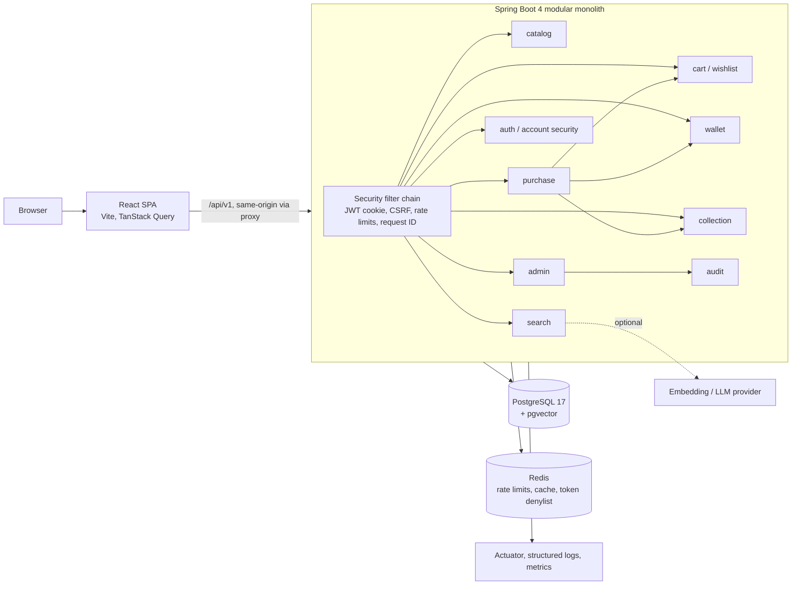

# TrustKart Implementation Plan

**TrustKart: Shop everything. Spend nothing.**

TrustKart is a virtual technology-shopping platform. Users browse premium
technology (PCs, servers, GPUs, networking, storage, printers, monitors,
peripherals, homelab gear), build carts and complete realistic checkouts paid
with a **virtual balance**. No products are sold, no real payments occur, no
financial information is collected and nothing ships.

The shopping is simulated. The engineering is not: money is `BigDecimal`,
wallet updates are atomic and idempotent, prices are always recalculated
server-side, and authentication, RBAC, audit logging and rate limiting are
built as they would be for a real store.

Status of this document: **living plan**, written 2026-09-27 at the end of
Phase 0 and revised the same day for the virtual-commerce direction.

---

## 1. Current repository assessment (Phase 0 audit)

### 1.1 Git state

| Item | Finding |
|---|---|
| Remote | `github.com/VijaysinghPuwar/TrustKart` (private; renamed from `WDP.AmazonClone`) |
| Branch | `main`, clean, up to date. All rebuild work happens on `trustkart-rebuild`. |
| History | 27 commits, all "Update index.html / style.css / README.md" |
| GitHub Pages | Not enabled (API returns 404), so the old deploy workflow has nothing live |

### 1.2 Legacy static clone

| File | What it is | Decision |
|---|---|---|
| `index.html` | Static Amazon homepage clone, "Search Amazon", Amazon categories, Font Awesome CDN | Retire |
| `style.css` | Styles for the clone | Retire |
| `first.js` | **0 bytes**, loaded synchronously in `<head>` | Retire |
| `amazon_logo.png` | Amazon trademark | Retire (must not ship) |
| `hero_image.jpg`, `box1..8_image.jpg` | Stock-style banners of unknown provenance | Retire (licence unknown, not tech products) |
| `README.md` | "Amazon Clone" README with `yourusername` placeholder, false "interactive" claim | Replace |
| `.github/workflows/static.yml` | Deploys **the entire repo root** to Pages on push to `main` | Replace. Left in place it would publish the monorepo (docs, compose files) as a static site. |

Nothing in the legacy code is reusable: no build system, no components, no
data, no tests. It is retired in a single commit so it stays recoverable
from history (`git show <sha>^:index.html`).

### 1.3 Design inputs (`~/Downloads/TrustKart shop redesign/`)

| File | Role |
|---|---|
| `TrustKart Home.dc.html` | **Approved visual source of truth.** Dark two-row header, hero tile grid, trust strip, product shelves, category grid, footer, compare tray, toast. Matches `.thumbnail`. |
| `ProductCard.dc.html` | Approved product card with skeleton, badges, wishlist, stock states, compare checkbox |
| `TrustKart Design System.dc.html` | Tokens: logo, colour, type, spacing, radius, elevation, buttons, inputs, badges (file is truncated after section 07) |
| `uploads/design.md` | Full design brief v0.1: tokens, components, screens, flows, a11y rules |
| `TrustKart.dc.html` | **Superseded** earlier iteration (white header, centred hero). Uses `"Amazon Ember"` font. Not used. |
| `assets/trustkart-logo.jpg` | 4096x4096 app-icon logo (cart + shield + check). Identical bytes to `~/Downloads/logo.jpg` and `uploads/make_it_entire_blue...jpg` (md5 `370d737c`). 6 MB, so it must be re-encoded. |
| `uploads/Screenshot ... 10.23.57 / 10.29.35` | Screenshots of amazon.com given to the design tool as layout reference. **Not** a spec. |
| `uploads/Screenshot ... 10.28.31` | "How Smart Search works / What verified means" section. Its data exists in the Home script (`steps`, `verifiedInfo`) but its markup was removed from the approved Home file, so it is treated as cut. |

### 1.4 Design audit: extracted system

**Colour tokens** (light / dark), from the Home file's CSS variables with
`design.md` fallbacks:

| Token | Light | Dark | Use |
|---|---|---|---|
| `bg` | `#F8FAFC` | `#0B1120` | page |
| `surface` | `#FFFFFF` | `#111827` | cards |
| `surface-2` | `#F1F5F9` | `#1A2332` | image wells, hovers |
| `border` | `#E2E8F0` | `#1F2937` | dividers |
| `border-strong` | `#CBD5E1` | `#334155` | inputs, secondary buttons |
| `ink` | `#0F172A` | `#E2E8F0` | text |
| `ink-muted` | `#475569` | `#94A3B8` | meta |
| `ink-subtle` | `#94A3B8` | `#64748B` | placeholders |
| `primary` | `#1E5EFF` | `#5B8CFF` | actions, links, focus |
| `primary-hover` | `#1649CC` | `#7CA3FF` | |
| `primary-subtle` | `#E8EFFF` | `#16244A` | chips |
| `on-primary` | `#FFFFFF` | `#0B1120` | |
| `trust` (text) | `#0B7A55` | `#34C796` | security/verified meaning only |
| `trust-subtle` | `#E6F6F0` | `#0F2A22` | |
| `accent` | `#FF8A00` | `#FFA53D` | Add to cart only (plus cart count) |
| `accent-hover` | `#F07F00` | `#FFB463` | |
| `warning` | `#B7791F` | `#E0A84A` | low stock |
| `warning-subtle` | `#FDF3E1` | `#2A2111` | |
| `danger` | `#D93025` | `#FF6B61` | errors, destructive |
| `header` | `#0F172A` | same | header row 1 |
| `header-2` | `#1E293B` | same | category nav row |

**Type**: Inter 400/500/600/700, JetBrains Mono 500 for IDs. Tabular numerals
for all prices. Sizes actually used: 10, 11, 12, 13, 14, 15, 17, 18, 21, 22,
28, `clamp(26px, 2.6vw, 34px)`.

**Spacing**: 4-px based, used values 2 to 56. **Radius**: 5 (badges), 6
(chips, nav hover), 8 (inputs, small buttons, thumbnails), 10 (buttons,
dropdowns), 12 (cards), 14 (hero tiles, trays). **Shadows**: sm / md / lg as
in `design.md`. **Motion**: 120 ms press, 200 ms, 280 ms,
`cubic-bezier(.2,.8,.2,1)`, all disabled under `prefers-reduced-motion`.

**Layout**: max content width 1440, side gutter `clamp(12px, 3vw, 24px)`.
Hero grid 4 cols ≥ 1024, 3 cols ≥ 640, 2 cols below. Search moves to its own
full-width row below 1100 px. Product rows scroll inside their own container
(220 px columns, 172 px on mobile). Product grid `auto-fill minmax(210px)`.

**Components identified**: SiteHeader (brand, balance slot, SmartSearch,
account nav, alerts, cart), CategoryNav, SmartSearch (input, Smart/Exact
radiogroup, suggestion listbox with intent chips, keyboard nav), HeroFeature,
CollectionTile, TrustStrip, Shelf (row | grid | empty), ProductCard (+
skeleton), CategoryTile, SiteFooter, CompareTray, Toast, DemoBanner,
StatusBanner (Smart Search unavailable).

### 1.5 Design issues found and how they are handled

| Issue in generated design | Handling |
|---|---|
| Inline styles everywhere, layout computed from `window.innerWidth` in JS | Rebuilt with CSS (Tailwind + tokens) and media/container queries. No JS layout. |
| Skip link at `left:-9999px`, never becomes visible | Proper visually-hidden-until-focused skip link |
| Search suggestions: `role="listbox"` but input lacks `role="combobox"`, `aria-controls`, `aria-activedescendant` | Implement the WAI-ARIA combobox pattern |
| Smart/Exact uses `role="radio"` buttons without arrow-key handling | Real radio inputs styled as a segmented control |
| Notifications `role="dialog"` without focus management | Disclosure popover with focus return and Escape |
| Focus ring: design says 2 px primary, but primary on the dark header is low contrast | White/primary dual ring on dark surfaces |
| Toast `role="status"` recreated per message | Single persistent live region |
| Product images are grey boxes | Openly licensed photos (see `docs/ASSET_SOURCES.md`) |
| Sample data is hiking shoes and coffee | Replaced by a technology catalog |
| Header copy mirrors amazon.com ("Deliver to", "Returns & Orders", "Hello, sign in") | Kept layout, replaced copy: balance slot instead of "Deliver to", "Orders & Collection" |
| Unbacked claims: "Verified seller" badges, "Lowest price in 30 days", star ratings with no reviews, "AI recommendation", newsletter "check your inbox" | Removed until the data exists. TrustKart is single-retailer, so "verified seller" has no meaning. Ratings render the design's "No reviews yet" state until reviews ship. |

---

## 2. Product model: virtual commerce

### 2.1 Core loop

Browse → Dream → Cart → Virtual Checkout → Collection → Repeat.

### 2.2 Transparency rules

- A global, subtle **Virtual Store** indicator in the header next to the balance.
- Explicit simulation copy at: wallet, checkout (payment and review steps),
  confirmation, purchase history, receipt, and in the README and the project page.
- Never on every product card. Product pages look like a real store.
- Banned words in UI: "Pay now", "Charge", "Billing", "Shipped", "Delivered",
  "on its way". Use "Virtual Checkout", "Place Virtual Order", "Completed",
  "Added to Collection".
- The catalog uses real product names for realism, with a footer and About
  statement that TrustKart is a portfolio simulation, not a reseller, and has no
  affiliation with the brands shown.

### 2.3 What changed from the original brief

| Original | Now | Why |
|---|---|---|
| Stripe test-mode payments, webhooks | **Removed from the purchase path.** No payment provider. | Nothing is sold. Asking for card data, even test data, would contradict "no financial information required". |
| Order states PENDING…SHIPPED…DELIVERED, returns | `COMPLETED`, `REFUNDED` (virtual) | Nothing ships. A refund restores balance and removes items from the collection. |
| Shipping address required | Optional **simulation address** or presets (Home, Office, Dream Setup, Homelab, Collection) | Data minimisation. |
| Delivery estimates on cards | Removed | Nothing ships. |
| Payment state machine | Virtual ledger with double-entry-style audit (`balance_before` / `balance_after`) | Keeps the correctness story interviewers care about. |

The webhook-verification and payment-idempotency learning goals move to the
wallet: idempotency keys on purchases and credits, pessimistic row locks,
atomic rollback tests.

---

## 3. Target architecture



### 3.1 Why a modular monolith

One deployable, one database, one transaction boundary. The purchase flow
touches cart, wallet, inventory and collection in a single ACID transaction,
which is trivial in a monolith and a saga in microservices. Module boundaries
are enforced by package structure and an ArchUnit test so it can be split
later if it ever needs to be. (ADR 001)

### 3.2 Repository layout

The repo is already named TrustKart, so the monorepo lives at the root rather
than in a nested `trustkart/` folder.

```text
/
├── backend/                  Spring Boot (Maven wrapper)
│   └── src/main/java/com/vijaysinghpuwar/trustkart/
│       ├── TrustKartApplication.java
│       ├── common/           errors, request ID, money, paging DTOs
│       ├── config/           security, CORS, OpenAPI, Jackson, cache
│       ├── catalog/          product, category, brand, specs, inventory
│       ├── search/           exact search, query parsing, semantic (Phase 9)
│       ├── cart/
│       ├── wishlist/
│       ├── wallet/           VirtualWallet, VirtualTransaction
│       ├── purchase/         VirtualPurchase, checkout orchestration
│       ├── collection/       owned items, stats, achievements
│       ├── auth/             users, roles, sessions, TOTP, passkeys
│       ├── audit/
│       └── admin/
├── frontend/                 Vite + React + TS
│   └── src/
│       ├── app/              router, providers, layout
│       ├── components/{ui,layout,commerce,search,wallet,account,admin}
│       ├── features/         per-route pages + hooks
│       ├── lib/              api client, money formatting, a11y helpers
│       └── styles/           tokens.css, globals
├── e2e/                      Playwright
├── docs/
│   ├── IMPLEMENTATION_PLAN.md, FEATURE_MATRIX.md, ASSET_SOURCES.md
│   └── adr/
├── docker-compose.yml
├── .github/workflows/
├── README.md, SECURITY.md, CONTRIBUTING.md, .env.example
```

Each backend module holds `api/` (controllers, DTOs), `application/`
(services, use cases), `domain/` (entities, enums, rules) and `infra/`
(repositories, adapters) where the module is big enough to justify it. Small
modules stay flat.

---

## 4. Technology decisions

Versions checked on 2026-09-27 against start.spring.io metadata and Maven
Central.

| Concern | Choice | Reason |
|---|---|---|
| Language | **Java 21 LTS** | Requested; supported by Boot 4.1. Java 25 LTS is also supported and can be adopted later. |
| Framework | **Spring Boot 4.1.1** (current GA) | Boot 3.5 OSS support has ended. Boot 4 ships Spring Security 7 (built-in WebAuthn/passkeys). |
| Build | Maven wrapper | Ubiquitous; no local Maven required |
| DB | PostgreSQL 17 with pgvector (`pgvector/pgvector:pg17` image) | JSONB for specs, `NUMERIC` for money, `SELECT … FOR UPDATE`, full-text search and vectors in one store (ADR 003) |
| Migrations | Flyway, `ddl-auto=validate` | Schema is only ever changed by migrations |
| Cache / limits | Redis 8 + Bucket4j 8.20 (Lettuce) | Distributed rate-limit buckets shared across instances, JWT denylist, catalog cache (ADR 004) |
| API docs | springdoc-openapi 3.1.1 | Boot 4 line. Swagger UI on in `dev`, off by default in `prod`. |
| Auth tokens | nimbus-jose-jwt via Spring Security OAuth2 Resource Server | Standard, no custom crypto |
| Passwords | Argon2id (`Argon2PasswordEncoder`) | OWASP-recommended; BCrypt accepted for upgrade path via `DelegatingPasswordEncoder` |
| TOTP | RFC 6238 implemented over `javax.crypto` HMAC (small, fully tested) or `dev.samstevens.totp` 1.7.1 | Decided in Phase 7 after reviewing the library's maintenance |
| AI search | Spring AI (Boot 4 compatible) + pgvector, provider optional | Store must work without it (ADR 006) |
| Frontend | React 19, TypeScript strict, Vite, TanStack Query, React Router, Tailwind CSS v4 | Tailwind `@theme` maps design tokens directly |
| Tests | JUnit 5, Mockito, AssertJ, Testcontainers (PostgreSQL, Redis), MockMvc, ArchUnit; Vitest + Testing Library; Playwright + axe-core | |
| Quality | Spotless (Google Java Format) is **not** added; Checkstyle is not added. SpotBugs only in CI. ESLint + Prettier on the frontend. | Small, justified toolset |
| Supply chain | Dependabot (maven, npm, actions, docker), GitHub dependency review, Gitleaks, `npm audit --audit-level=high` as a signal | |

Deliberately **not** used: Stripe, Kubernetes, microservices, Kafka, GraphQL,
Lombok (records and explicit code read better in interviews), MapStruct
(hand-written mappers are few and clear).

---

## 5. Migration strategy

1. Branch `trustkart-rebuild`. `main` is untouched until the user merges.
2. Commit docs (this plan, feature matrix).
3. Retire legacy files in one commit.
4. Scaffold `backend/`, `frontend/`, compose, CI.
5. Each phase lands as one or more logical commits after its verification
   checklist passes. Nothing is pushed without explicit permission.

---

## 6. Design conversion strategy

1. `frontend/src/styles/tokens.css` holds CSS custom properties for light and
   dark (from §1.4). Tailwind v4 `@theme inline` maps them to utilities
   (`bg-surface`, `text-ink-muted`, `rounded-card`), so no arbitrary hex values
   appear in components.
2. Components are built bottom-up (`ui/` primitives: Button, Badge, Price,
   Skeleton, IconButton, Dialog, Drawer, Popover, VisuallyHidden) then
   composites.
3. Every page is a thin composition of feature components. The target is no
   file over about 250 lines.
4. Visual verification in a real browser against the design at 320, 375, 390,
   430, 768, 1024, 1280, 1440, 1728 and 1920, in light and dark.
5. Deviations are logged in §1.5 and in the PR description.

### 6.1 Virtual-commerce adaptations to the approved design

| Design element | Adaptation |
|---|---|
| Header "Deliver to" button | Balance chip: "Virtual balance $100,000.00" (or "∞ Unlimited"). Links to Wallet. |
| "Returns & Orders" | "Orders & Collection" |
| Hero "Deal of the day" blue card | Identity hero: "Shop everything. Spend nothing." with one featured product, "Add to cart", "View product" |
| Hero tiles | Real, data-backed collections: Keep shopping for (recently viewed), Dream GPUs, Developer setup, Homelab starter, Servers & workstations, Your wallet/collection (signed in or guest with wallet) |
| Trust strip | No real payments · No financial info required · Secure accounts · Virtual purchases only |
| Footer payment badges (Visa, PayPal…) | Removed. Replaced by "Virtual checkout: no card, no bank, no billing details." |
| Newsletter | Removed until notifications exist |

---

## 7. Database model

All money columns are `NUMERIC(19,2)` mapped to `BigDecimal` (scale 2,
`RoundingMode.HALF_EVEN`). Timestamps are `timestamptz`. Primary keys are
`bigint` identity internally, with a `uuid` public ID on anything exposed
through URLs that is user-owned (wallet, purchase, cart items, collection) so
IDs are not enumerable.

### 7.1 Catalog (Phase 3)

- `category` (id, slug unique, name, parent_id, sort_order, description)
- `brand` (id, slug unique, name)
- `spec_definition` (id, category_id, key, label, data_type TEXT|NUMBER|BOOLEAN,
  unit, group_label, filterable, comparable, sort_order; unique (category_id, key))
- `product` (id, sku unique, slug unique, name, brand_id, category_id,
  summary, description, price, compare_at_price, warranty_months,
  specs JSONB, keywords text[], search_vector tsvector generated, featured,
  status ACTIVE|DRAFT|DISCONTINUED, created_at, updated_at, version)
  - GIN on `specs`, GIN on `search_vector`, btree on (category_id, price)
  - CHECK price > 0, compare_at_price > price
- `product_image` (id, product_id, path_800, path_400, width, height, alt,
  match_type, sort_order)
- `inventory` (product_id PK/FK, available, reserved, low_stock_threshold,
  backorder_allowed, updated_at, version). CHECK available ≥ 0, reserved ≥ 0.
  Stock status (IN_STOCK, LOW_STOCK, OUT_OF_STOCK, BACKORDER, DISCONTINUED) is
  derived, not stored.
- `collection_tag` (product_id, tag) for curated rows such as `homelab-starter`.

**Specs model (ADR 005)**: JSONB column plus a per-category `spec_definition`
registry. Alternatives: wide nullable columns (100+ columns, migration per new
category), EAV tables (painful typed filtering, many joins). JSONB gives typed
containment and range filters with GIN indexes while the registry drives
labels, units, filter UI and comparison rows.

**Inventory in a virtual store**: stock is still tracked, because stock
states and "can't oversell" are part of the realism and a strong concurrency
demo. A virtual purchase decrements `available` with a conditional
`UPDATE … WHERE available >= :qty`. A scheduled demo restock job (demo
profile only) tops items back up so the shared catalog never empties.

### 7.2 Identity and security (Phase 4, 7)

`app_user`, `role`, `permission`, `role_permission`, `user_role`,
`user_session` (refresh-token family, hashed token, device, ip, created,
last_seen, revoked_at), `login_event`, `security_alert`, `totp_credential`,
`backup_code` (hashed), `passkey_credential`, `audit_log`.

### 7.3 Shopping (Phase 5, 6)

- `cart` (id, owner_type USER|GUEST, owner_id, updated_at), `cart_item`
  (cart_id, product_id, quantity 1..99, saved_for_later, added_at)
- `wishlist` (id, owner, name), `wishlist_item`
- `virtual_wallet` (id, public_id, owner, balance NUMERIC(19,2), mode
  BUDGET|UNLIMITED, created_at, updated_at, version). CHECK balance ≥ 0 and
  ≤ 1,000,000,000,000.00.
- `virtual_transaction` (id, wallet_id, type CREDIT|PURCHASE|REFUND|RESET,
  amount, balance_before, balance_after, reference, idempotency_key,
  created_at). Append-only. Unique (wallet_id, idempotency_key).
- `virtual_purchase` (id, public_id, order_number `TK-YYYYMMDD-NNNN`, owner,
  status COMPLETED|REFUNDED, item_count, subtotal, total, balance_before,
  balance_after, wallet_mode, simulation_address JSONB, idempotency_key,
  created_at, refunded_at). Unique (owner, idempotency_key).
- `virtual_purchase_item` (purchase_id, product_id, name_snapshot,
  unit_price_snapshot, quantity, line_total)
- `collection_item` (owner, product_id, purchase_item_id, acquired_at,
  collection_name nullable, removed_at)
- `setup` / `setup_item` (Build Your Dream Setup, Phase 10)
- `achievement_unlock` (owner, code, unlocked_at)

### 7.4 Guests

A guest gets an opaque random ID in an HttpOnly, SameSite=Lax, signed cookie.
Carts, wallets, purchases and collections are owned by either a user or a
guest (`owner_type`, `owner_id`). Guest data expires after 30 days of
inactivity (scheduled cleanup). On sign-up or sign-in the user is offered a
merge. The merge runs in one transaction and is idempotent.

---

## 8. API plan (v1)

```text
Catalog
GET  /api/v1/categories                       tree + counts
GET  /api/v1/categories/{slug}/filters        spec facets for a category
GET  /api/v1/products?q=&category=&brand=&minPrice=&maxPrice=&availability=&spec.<key>=&sort=&page=&size=
GET  /api/v1/products/{slug}
GET  /api/v1/products/compare?slugs=a,b,c     2 to 4 products, aligned spec rows
GET  /api/v1/collections/{tag}                curated rows
GET  /api/v1/search/suggest?q=
GET  /api/v1/search?q=&mode=smart|exact       results + interpretation chips + mode actually used

Auth / account
POST /api/v1/auth/register | login | logout | refresh
POST /api/v1/auth/password/forgot | reset
POST /api/v1/auth/2fa/setup | verify | disable
GET  /api/v1/me   GET/DELETE /api/v1/me/sessions[/{id}]   GET /api/v1/me/login-events

Cart / wishlist
GET    /api/v1/cart
POST   /api/v1/cart/items              {productId, quantity}
PATCH  /api/v1/cart/items/{id}         {quantity | savedForLater}
DELETE /api/v1/cart/items/{id}
GET/POST/DELETE /api/v1/wishlists...

Wallet
GET  /api/v1/wallet                          balance, mode
POST /api/v1/wallet/credits                  {amount} + Idempotency-Key
POST /api/v1/wallet/reset
PUT  /api/v1/wallet/mode                     {mode}
GET  /api/v1/wallet/transactions?page=

Purchase
POST /api/v1/checkout/quote                  server-priced preview (no writes)
POST /api/v1/purchases                       {addressPreset|simulationAddress} + Idempotency-Key
GET  /api/v1/purchases?page=   GET /api/v1/purchases/{publicId}   GET .../receipt
POST /api/v1/purchases/{publicId}/refund     Idempotency-Key

Collection
GET  /api/v1/collection   GET /api/v1/collection/stats   GET /api/v1/achievements

Admin (permission-guarded)
/api/v1/admin/products, /inventory, /categories, /purchases, /users, /audit-log,
/security/events, /analytics (all monetary figures labelled virtual)
```

Conventions: DTO records only (entities never leave the service layer),
Jakarta Validation on every input, `Page` responses with `{items, page, size,
totalItems, totalPages}`, errors as RFC-9457-style JSON with `code`,
`fieldErrors` and `requestId` (surfaced to users as `REQ-XXXXXX`).

**The client never sends a price, total, discount or balance.** Purchase
requests carry only the idempotency key and an optional address choice. The
server reads the cart, reprices from `product.price`, and computes the total.

---

## 9. Virtual purchase: transaction design

`PurchaseService.placeVirtualOrder(owner, request, idempotencyKey)` runs in
one `@Transactional` (READ COMMITTED) method:

1. If a purchase with `(owner, idempotencyKey)` exists, return it (replay).
2. `SELECT … FROM virtual_wallet WHERE owner = ? FOR UPDATE` serialises all
   purchases and credits for this wallet.
3. Load cart items (not saved-for-later). Reject if empty.
4. Reprice every line from the product table. Reject discontinued products.
5. Decrement inventory with `UPDATE inventory SET available = available - :q
   WHERE product_id = :id AND available >= :q`. 0 rows means out of stock,
   and the whole transaction rolls back.
6. BUDGET mode: if `balance < total`, throw `InsufficientVirtualFunds`
   carrying the shortfall ("You need $2,000.00 more virtual funds").
7. Insert `virtual_purchase` + items. The unique `(owner, idempotency_key)`
   constraint is the final guard against a concurrent duplicate.
8. Update the wallet balance and append a `virtual_transaction` (PURCHASE)
   with `balance_before` / `balance_after`.
9. Insert `collection_item` rows, clear purchased cart lines, evaluate
   achievements.
10. Commit. Any exception rolls back every step.

Tests (Testcontainers PostgreSQL): replayed key returns the same purchase
with a single deduction; 10 concurrent purchases on a $X wallet never go
negative; failure injected after deduction leaves balance, cart and
inventory unchanged; manipulated price fields are ignored (unknown JSON
properties rejected); negative, zero, over-scale and over-limit credits
rejected; user A gets 404 for user B's wallet, purchase and collection.

---

## 10. Security plan

| Risk | Control |
|---|---|
| Credential stuffing, brute force | Bucket4j limits per IP and per account on login, register, reset, 2FA; generic "email or password is incorrect"; login events; lockout UI after N failures |
| Session theft | Access JWT (10 min) in HttpOnly Secure SameSite=Lax cookie; opaque refresh token (14 days) in HttpOnly cookie scoped to `/api/v1/auth`, stored as SHA-256 hash, rotated on every use, **reuse detection revokes the whole family** |
| CSRF | Cookie auth means CSRF is required: Spring Security `CookieCsrfTokenRepository` SPA pattern (`XSRF-TOKEN` cookie, `X-XSRF-TOKEN` header) plus SameSite. Not disabled. (ADR 002) |
| Revocation | Session ID (`sid`) claim; logout or revoke puts `sid` in a Redis denylist until the access token expires |
| IDOR / BOLA | Every owned-resource query filters by the authenticated owner; public IDs are UUIDs; foreign lookups return 404, not 403 |
| Broken access control | Method security with permissions (`catalog:write`, `purchase:read:any`, `security:read`, `audit:read`, `user:manage`); roles CUSTOMER, SUPPORT, CATALOG_MANAGER, ORDER_MANAGER, SECURITY_ANALYST, ADMIN |
| Mass assignment | Request DTO records with explicit fields; `FAIL_ON_UNKNOWN_PROPERTIES` on for write endpoints |
| Injection | JPA parameter binding, Criteria/`JdbcClient` with named params, spec keys validated against `spec_definition` before use in JSONB paths |
| XSS | React escaping, no `dangerouslySetInnerHTML`, strict CSP (`default-src 'self'`, no inline script) |
| Clickjacking | `frame-ancestors 'none'`, `X-Frame-Options: DENY` |
| Transport | HSTS in prod, `Referrer-Policy: strict-origin-when-cross-origin`, `Permissions-Policy` minimal, `X-Content-Type-Options: nosniff` |
| CORS | Explicit allow-list from `TRUSTKART_ALLOWED_ORIGINS`; credentials only for listed origins; not needed at all when the SPA is proxied same-origin |
| Open redirect | Post-login `returnTo` only accepts relative paths from an allow-list |
| Wallet abuse | Credit endpoint validates 0.01 ≤ amount ≤ 10,000,000.00, scale ≤ 2, balance cap 1e12; rate limited |
| Audit | `audit_log` for admin actions and sensitive account events; never logs secrets, tokens, TOTP seeds or passwords |
| Errors | Global `@RestControllerAdvice`; no stack traces, SQL or paths in responses |

Documented honestly in `SECURITY.md` as controls mapped to OWASP Top 10
risks, not as "OWASP compliant".

---

## 11. Testing plan

| Layer | Tooling | Focus |
|---|---|---|
| Unit | JUnit 5, AssertJ | money math, stock status, query parser, spec filters, wallet rules, PC compatibility rules |
| Web slice | MockMvc | validation, error format, auth rules per endpoint |
| Integration | Testcontainers PostgreSQL + Redis, `@SpringBootTest` | migrations, repositories, JSONB filters, purchase atomicity, concurrency, rate limiting |
| Architecture | ArchUnit | module boundaries, no controller → repository shortcuts |
| Frontend unit | Vitest + Testing Library | search combobox keyboard behaviour, money formatting, cart hooks |
| E2E | Playwright | search → product → cart → virtual checkout → collection; auth; admin |
| A11y | `@axe-core/playwright` on key pages + manual keyboard pass | |

A shared Testcontainers setup (`@ServiceConnection`, reused container) keeps
the suite fast.

---

## 12. Deployment plan

- **Frontend**: Vercel (static SPA build). `vercel.json` rewrites `/api/*` to
  the backend origin so cookies stay first-party and CORS is not needed.
- **Backend**: container image (multi-stage, non-root, layered jar) on a
  container host (Render, Fly.io or Google Cloud Run), with managed PostgreSQL
  (pgvector-capable) and managed Redis. Vercel does not run Spring Boot as a
  standard deployment. Container support on Vercel will be re-checked when
  ADR 008 is written, and used if it fits.
- No paid infrastructure is created without explicit approval.

---

## 13. Phases

| Phase | Scope | Exit criteria |
|---|---|---|
| 0 | Audit, this plan, feature matrix | Docs reviewed |
| 1 | Monorepo, Boot app, React app, compose (Postgres + Redis), health endpoint, request ID, error format, CI skeleton, legacy retired | `./mvnw verify` green with Testcontainers; `npm run lint/typecheck/test/build` green; compose boots; `/actuator/health` UP |
| 2 | Design system + Home, header, Smart Search UI (exact only), product card, category grid, footer | Browser check at all widths, light and dark, axe clean |
| 3 | Catalog schema, seed (~100 products, openly licensed images), product/category/search APIs, filters, sort, pagination, product page, search page | API + repo tests, E2E search → product |
| 4 | Auth: register/login/logout/refresh rotation, Argon2id, RBAC, CSRF, rate limits, login events, guest identity | Security test suite green |
| 5 | Cart, save for later, wishlist + named lists, guest→user merge | |
| 6 | **Wallet + virtual checkout**: wallet, credits, modes, quote, purchase transaction, idempotency, confirmation, receipt, purchase history, refund, collection | Atomicity + concurrency + IDOR tests |
| 7 | Security Center: sessions, login history, TOTP + backup codes, passkeys (Spring Security 7 WebAuthn) | |
| 8 | Admin: catalog, inventory, virtual purchases, users/roles, audit log, security events, virtual analytics | Permission matrix tests |
| 9 | Semantic search: pgvector embeddings, hybrid ranking, intent chips, graceful fallback banner | Fallback tested with provider down |
| 10 | Compare, Build Your Dream PC (deterministic compatibility rules), Dream Setup / Homelab builders, achievements, reviews | |
| 11 | Hardening: CSP verification, Docker hardening, dependency and secret scans, perf pass, full E2E + a11y, deployment config, README/SECURITY/ADRs final | Final audit checklist |

---

## 14. Risks

| Risk | Mitigation |
|---|---|
| Real product names read as a real store | Global Virtual Store indicator, About/footer disclaimer, no "authorized" language, simulation copy at money moments |
| Image licensing | Wikimedia Commons only, PD/CC0/CC BY/CC BY-SA, attribution in `ASSET_SOURCES.md` and on the product page; "representative image" flag when the photo is not the exact model |
| Spring Boot 4 ecosystem gaps (libraries lagging) | Every dependency checked against Boot 4 before adding |
| Scope size | Strict phase exit criteria; matrix never marks unverified work as done |
| Hosting cost | Free tiers first; nothing paid without approval |
| AI provider cost and availability | Optional; exact search always works; embeddings computed offline for the seed catalog if a provider is configured |

## 15. Assumptions

- Single retailer (TrustKart), no marketplace sellers.
- USD only, US-style formatting.
- Guest mode is supported; accounts are optional for shopping.
- Demo data loads only under the `demo` or `dev` profile, never in `prod` by default.
- The Home design file is authoritative for layout; `design.md` for tokens and behaviour where the Home file is silent.
